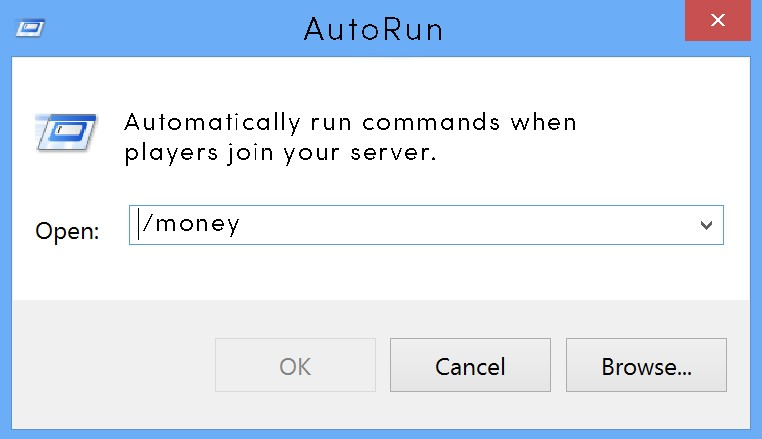

# Autorun

Autorun allows server admins to automatically run commands when a player joins a server, either just once or a specified number of times. The commands can be configured to run for a specific player, or have it run on all player joins. The commands can be configured to run from the user, or from the console. It is an extremely lightweight, easy, yet powerful plugin used to run commands on player join.

> [!WARNING]
> This plugin is from Minecraft Beta around 2010 for the [PilzBros Network](https://pilzbros.com). It was created by the developer while they were in High School. It's no longer maintained and last ran on MC 1.6+. It's being published here for historical purposes. The code quality, quite frankly, is abysmal. Don't code like this.

## Player vs All
- Player commands will run for a specific user only when they log into the server
- All commands will run for all users that log into the server 

## Execution Levels
- Player - Execute autorun command as if player executed it themselves
- OP - Execute autorun command as if player with OP permissions executed the command
- Console - Execute autorun command as if it were typed directly into the console. The epitome of permissions, only to be used wisely 

## UUID
Autorun is 100% UUID compliant, using player's UUID's for identification, rather than their usernames. When Mojang allows players to begin changing their usernames, Autorun commands will still execute for the same player, regardless of username changes, as all data is stored with their UUID's.

## Documentation
- [Permissions](docs/setup.md)
- [Commands](docs/commands.md)
- [Setup Guide](docs/setup.md)

## Legacy Links
- [Autorun Spigot Page](https://www.spigotmc.org/resources/autorun.14866/)
- [Autorun Bukkit Page](http://dev.bukkit.org/bukkit-plugins/autorun/)